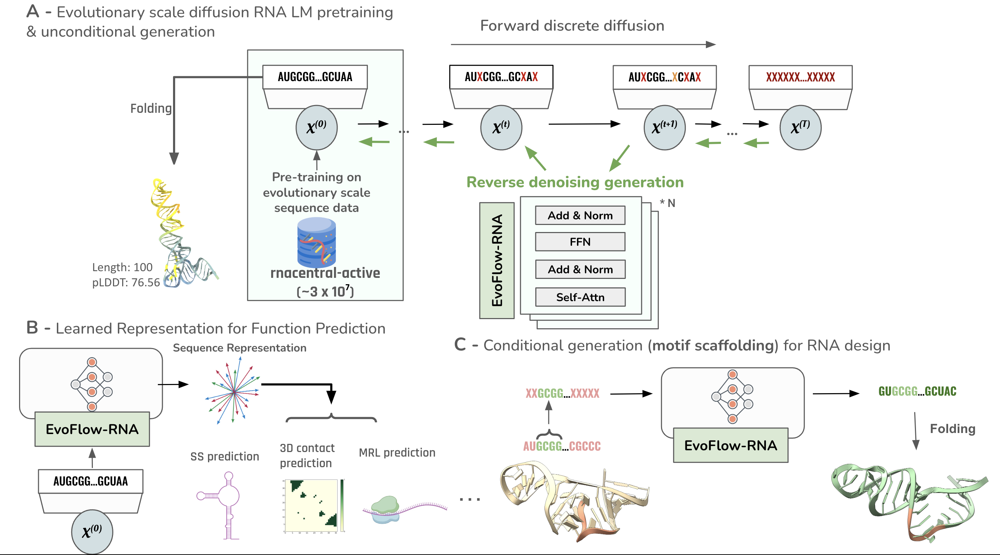

<!-- <div align="center"> -->

# EvoFlow-RNA 🧬 | A non-coding RNA masked diffusion model

[[Paper]](https://www.biorxiv.org/content/10.1101/2025.02.25.639942v2)[[Blog]](https://atombioworks.com/news/evoflow-rna-masked-discrete-diffusion/)



The inference suite for`EvoFlow-RNA`, a high-throughput model capable of generating novel, diverse and naturalistic non-coding RNA sequences. In this version, we only release the mini-sized model (33m). A future version will include additional model sizes and further functionality.

## Installation

We use CUDA 12.5 and Python 3.11 for this project. An additional key dependency is Flash-Attention v2. You can install our environment via `conda`.

```bash
# clone project
git clone --recursive https://url/to/this/repo/evoflow-rna.git
cd evoflow-rna

# create conda environment
conda env create -f env.yml

# activate environment
conda activate evoflow-rna

```

If any issues pertaining to `hydra` arise after setting up the environment, just uninstall `hydra-core` and re-install (including dependencies such as `hydra-colorlog`).

## Example

See the `example.ipynb` notebook for usage instructions, such as how to get embeddings and generate non-coding RNAs, both conditionally and unconditionally!

## Weights

EvoFlow-RNA mini weights are available [here](https://drive.google.com/drive/folders/16_XFmWFq3fVMK-nOhWUIyo8-1cLoScPm?usp=sharing). Store them in the `~/weights` path for example notebook compatability.

## License

This repository is kept under a `CC-BY-NC 4.0 International license`. All non-commercial projects are permitted to freely use, adopt, or build upon this work. See LICENSE.md for additional information.

## Acknowledgements

We built our repository off of [bytedance/dplm](https://github.com/bytedance/dplm) and their original work in protein sequence design with masked denoising discrete diffusion. We also encourage visiting the [RiNALMo](https://github.com/lbcb-sci/RiNALMo) repository as we absorbed much of their library. Please check out their work!

## Citations

Please cite our code if used in your work!

`
@article{patel2025evoflow,
  title={EvoFlow-RNA: Generating and Representing non-coding RNA with a Language Model},
  author={Patel, Sawan and Peng, Fred Zhangzhi and Fraser, Keith and Friedman, Adam D and Chatterjee, Pranam and Yao, Sherwood},
  journal={bioRxiv},
  pages={2025--02},
  year={2025},
  publisher={Cold Spring Harbor Laboratory}
}
`